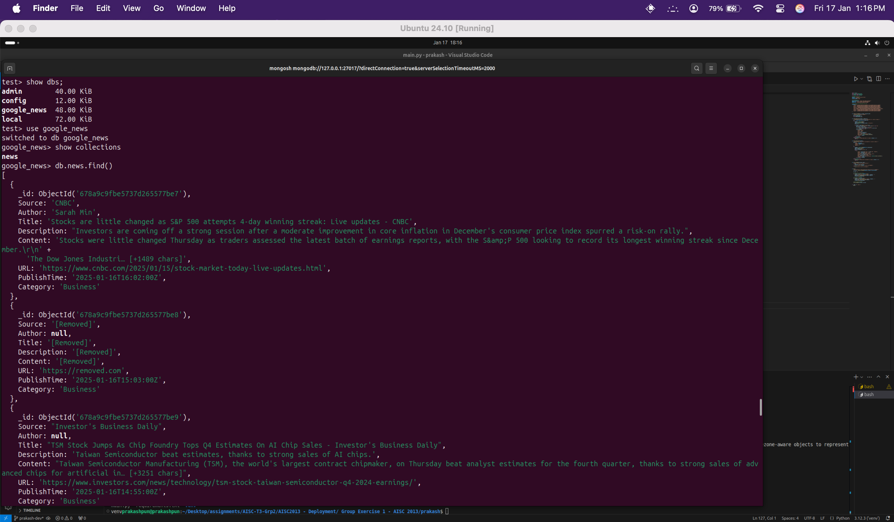

# Assignment 1

## Installation

```bash
python -m venv venv # Create a virtual environment
source venv/bin/activate # Activate the virtual environment
pip install -r requirements.txt # Install the dependencies
python main.py # Run the application
```

## Screenshots



## Command to view the database

```bash
> mongosh # Enter the MongoDB shell
> show dbs # Show all databases
> use news # Use the news database
> show collections # Show all collections
> db.news.find() # Find all documents in the news collection
```
